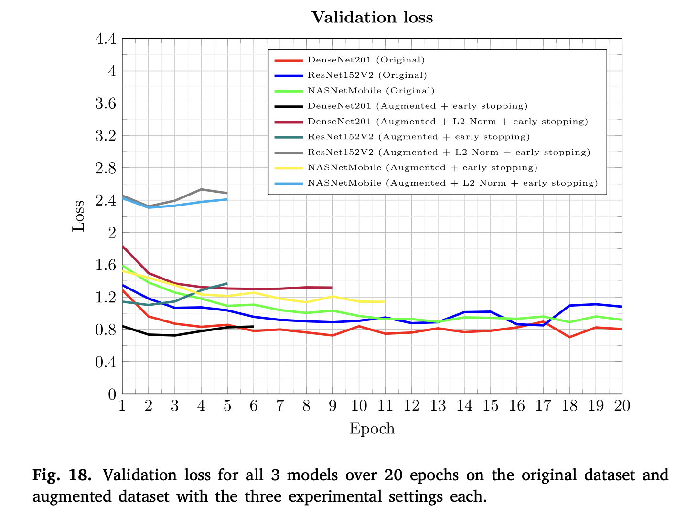
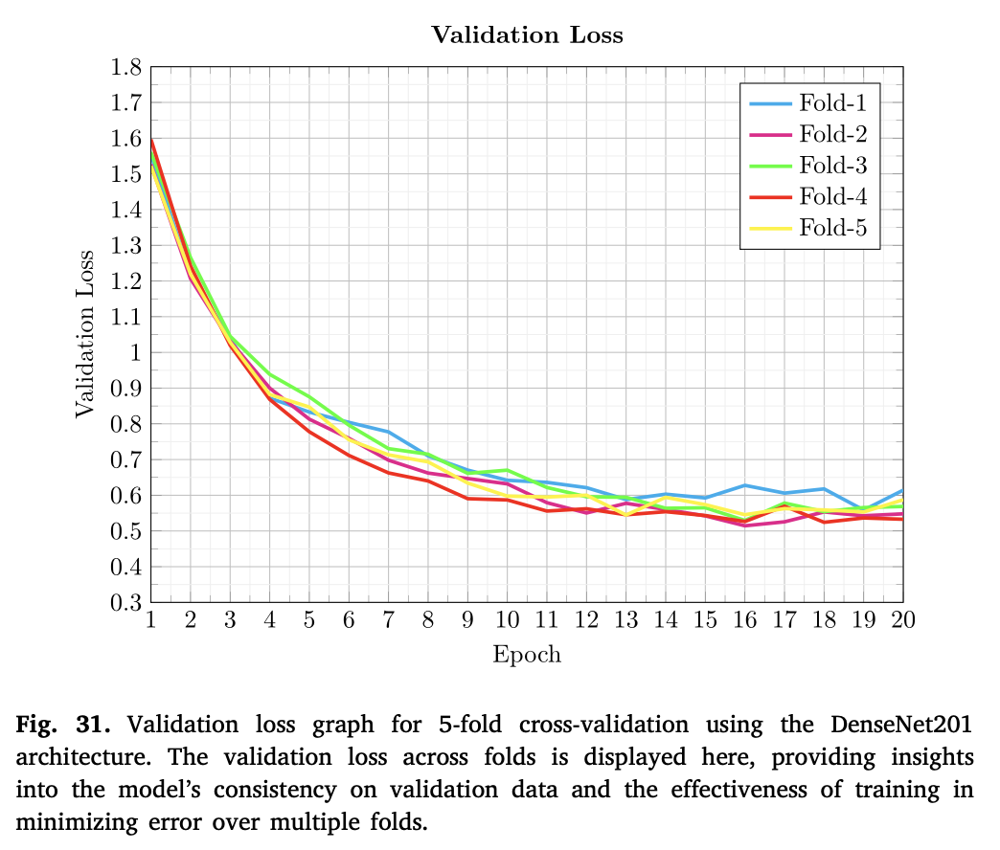

# 🥔 Potato Leaf Disease Classifier  
## *Enhancing crop productivity with fine-tuned deep convolution neural network for Potato leaf disease detection*

A deep learning-based system to classify six major potato leaf diseases using transfer learning (DenseNet201, ResNet152V2, NasNetMobile), strategic data augmentation, and L2 regularization.

📄 **Published in:** *Expert Systems with Applications* (Impact Factor: **7.5**)  
🔗 **DOI:** [10.1016/j.eswa.2024.126066](https://doi.org/10.1016/j.eswa.2024.126066)

---

### 🔍 **Abstract**

Potato plants (*Solanum tuberosum*) are prone to various diseases that result in substantial economic losses for farmers.  
This research presents a **deep learning-based approach** to accurately detect and classify **six distinct diseases** affecting potato leaves:
- Bacteria
- Viruses
- Fungi
- Phytophthora
- Pests
- Nematodes

To address **class imbalance**, we employed:
- 🎨 Strategic Data Augmentation  
- 🔒 L2 Regularization  
- 🧠 Transfer Learning  

Three pre-trained CNNs were fine-tuned on a **diverse real-world dataset of 3,076 leaf images**.  
📂 **Dataset Access:** [https://doi.org/10.17632/ptz377bwb8.1](https://doi.org/10.17632/ptz377bwb8.1)

🚀 **Results:**
- DenseNet201 achieved **77.14%** accuracy on the original dataset.
- With augmentation + k-fold cross-validation, accuracy improved to **81.31%**
  - 📈 4.17% boost over baseline  
  - 🔬 7.68% better than prior work

⚠️ NasNetMobile and ResNet152V2 showed performance degradation due to overfitting and low generalization.

✅ **Conclusion:**  
This approach provides a **scalable, field-deployable** solution for agricultural diagnostics—supporting **sustainable farming** and minimizing crop loss.

---

### 🌟 **Key Contributions**

- ✅ Deep learning framework for classifying six major potato leaf diseases with **improved accuracy, scalability**, and **class balance**.
- 🌀 **Strategic data augmentation** (basic + combinational) simulating real-world image capture conditions.
- 📊 Evaluation using **Precision, Recall, F1-score, Accuracy** for robust performance measurement.
- 🛠️ **Hyperparameter tuning** for optimization in agricultural settings.
- 🔍 Comparative study of **DenseNet201, ResNet152V2, NasNetMobile** across **3 training configurations**.
- 🧱 Applied **L2 regularization** and **early stopping** to reduce overfitting.
- 🌾 Broader disease spectrum than prior works—enhancing **generalizability** across diverse leaf conditions.

---

## 🧠 Methodology Flowchart  

  

  

This flowchart illustrates the overall pipeline of our proposed potato leaf disease classification system, covering **data preprocessing, augmentation, model training, evaluation, and deployment readiness**.

---

## 📊 Dataset Distribution (Before & After Augmentation)  

  
  

  

- The original dataset contained **3,076 images** with severe class imbalance.  
- Through **strategic augmentations** (rotations, flips, color jitter, etc.), underrepresented classes were balanced, resulting in a **more uniform dataset** that improved model generalization.  

---

## ⚙️ Algorithm  

  

  

The above diagram highlights the **training algorithm**, including:  
1. Input preprocessing  
2. Augmentation strategies  
3. Transfer learning with DenseNet201, ResNet152V2, and NasNetMobile  
4. Optimization with **early stopping + L2 regularization**  

---

## 📈 DenseNet201 Results  

### 🔹 Training & Validation Trends  

  
  

  

  
  

  

- DenseNet201 consistently outperformed the other models in terms of **validation accuracy and reduced overfitting**.  
- ResNet152V2 and NasNetMobile showed stronger signs of **performance degradation**.  

### 🔹 Confusion Matrices (DenseNet201)  

  
  
  

  

Confusion matrices demonstrate that **augmentation + regularization** improved classification across minority classes (Bacteria, Nematodes) while reducing misclassifications.  

---

## 📝 Classification Report (DenseNet201)  

  

  

The report shows precision, recall, and F1-scores across all six disease categories. DenseNet201 achieved **balanced performance**, highlighting improvements after augmentation.  

---

## 📊 Class-wise Accuracy (DenseNet201)  

  

  

- Accuracy improved significantly for **minority classes** after augmentation.  
- L2 regularization stabilized training, yielding better consistency across folds.  

---

## 🔄 K-Fold Cross Validation  

  
  

  

  

  

K-fold validation demonstrated **robust generalization**, confirming that DenseNet201 with augmentation + regularization consistently outperforms the baseline.  

---

## 📑 Comparative Study  

  

  

Compared to prior work, our proposed system achieved:  
- **+4.17% boost over baseline** using augmentation  
- **+7.68% improvement** compared to existing state-of-the-art  
- Better performance on underrepresented disease classes  

---

